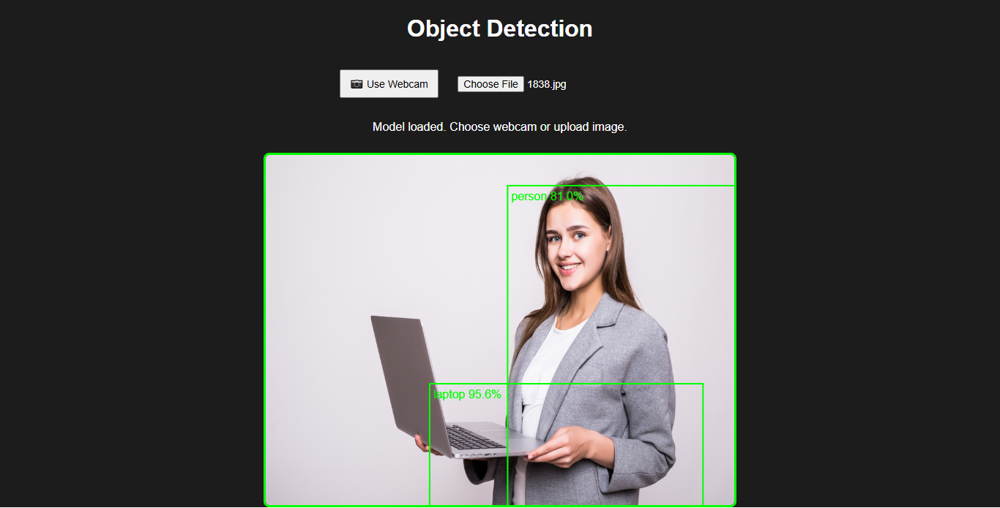

# Webcam & Image Object Detection with ml5.js

A web application that uses the COCO-SSD model via [ml5.js](https://ml5js.org/) to perform object detection on webcam input or uploaded images. Built with [p5.js](https://p5js.org/) for easy canvas handling.



## Features

- Real-time object detection using your webcam.
- Object detection on uploaded images.
- Highlights detected objects with bounding boxes and confidence scores.
- Lightweight and easy to use in-browser solution with no backend required.

## Demo

Open `index.html` in a modern browser, load the model, then either:

- Click **"Use Webcam"** to start detecting objects in your live video feed.
- Upload an image file to detect objects within a static picture.

## Installation

Simply clone the repository and open the `index.html` file in your browser:

```bash
git clone https://github.com/yourusername/webcam-image-object-detection-ml5.git
cd webcam-image-object-detection-ml5
open index.html
Usage
Click Use Webcam to start the webcam and detect objects live.

Or upload an image file to detect objects on it.

Detected objects will be highlighted with bounding boxes and labels.

Technologies Used
ml5.js (built on TensorFlow.js)

p5.js

COCO-SSD object detection model

License
MIT License © 2025 Your Name
